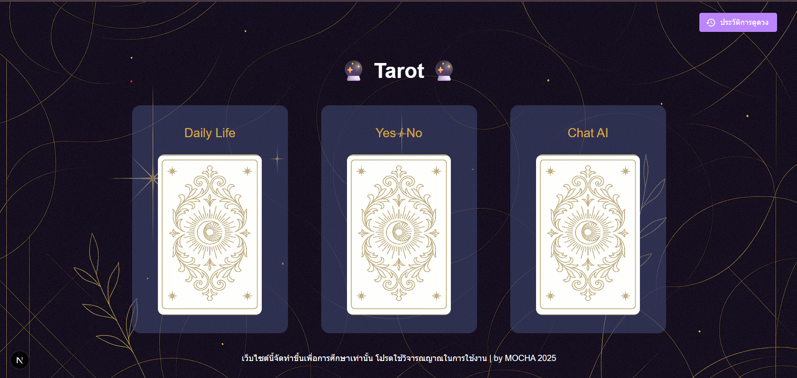
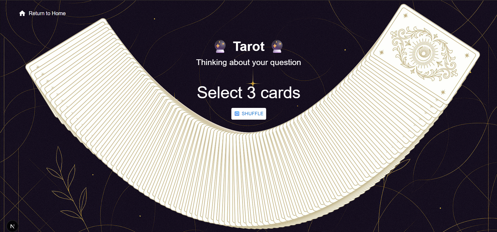
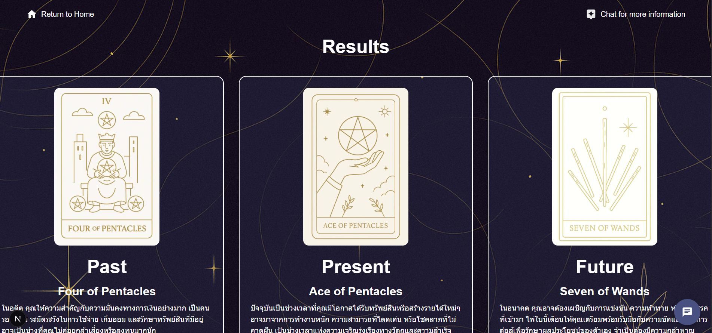

# 🔮 AI Tarot Web

[](https://opensource.org/licenses/MIT)

เว็บแอปพลิเคชันสำหรับดูไพ่ทาโรต์แบบอินเทอร์แอคทีฟ **หัวใจสำคัญของโปรเจกต์นี้คือการเป็นพื้นที่สำหรับฝึกฝนการเขียน AI Prompts** และการสร้างฟีเจอร์ AI บนเว็บไซต์จริง โดยใช้ Next.js เป็น Frontend และเชื่อมต่อกับ Google Gemini API เพื่อสร้างคำทำนายที่ลึกซึ้งและเป็นส่วนตัว



## ✨ Features

- **AI-Generated Artwork:** รูปภาพการ์ดและพื้นหลังทั้งหมดในเว็บสร้างขึ้นโดย AI 🎨
- **Interactive Card Deck:** สับและเลือกไพ่ด้วยอนิเมชันที่สวยงามและลื่นไหล
- **In-Depth AI Analysis:**
  - **Card Meanings:** คำอธิบายความหมายของไพ่แต่ละใบที่เลือก
  - **Overall Summary:** บทสรุปภาพรวมของคำทำนาย
  - **Stock Market Suggestions:** คำแนะนำหุ้นที่น่าสนใจตามผลของไพ่ 📈
- **Conversational AI Chat:** หลังจากได้รับผลคำทำนายแล้ว สามารถแชทเพื่อพูดคุยหรือถามคำถามเพิ่มเติมกับ AI ต่อได้ทันที 💬
- **Reading History:** บันทึกประวัติการดูดวงที่ผ่านมา โดยใช้ `localStorage` ของเบราว์เซอร์
- **Multiple Reading Modes:**
  - **Daily Life:** ทำนายเรื่องราวชีวิตประจำวัน (เลือก 3 ใบ)
  - **Yes / No:** สำหรับคำถามที่ต้องการคำตอบใช่หรือไม่ (เลือก 1 ใบ)
  - **AI Mode:** (อยู่ระหว่างการพัฒนา)





## 🤖 AI Interaction Flow (ขั้นตอนการทำงานของ AI)

1.  **Initial Interpretation:** เมื่อผู้ใช้เลือกไพ่ครบถ้วน AI จะทำการวิเคราะห์และแสดงผลลัพธ์ 3 ส่วนหลัก:
    1.  **ความหมายไพ่รายใบ:** เจาะลึกความหมายของไพ่แต่ละใบ
    2.  **บทสรุป:** สรุปความเชื่อมโยงของไพ่ทั้งหมดเพื่อตอบคำถาม
    3.  **คำแนะนำหุ้น:** วิเคราะห์และแนะนำหุ้นที่สอดคล้องกับพลังงานของไพ่
2.  **Follow-up Chat:** หลังจากแสดงผลครั้งแรก ผู้ใช้สามารถพิมพ์คำถามในช่องแชทเพื่อสนทนากับ AI ต่อได้ เช่น "ช่วยขยายความเรื่องการเงินให้หน่อย" หรือ "ไพ่ใบสุดท้ายหมายความว่าอย่างไร"

## 🛠️ Tech Stack

โปรเจกต์นี้เป็น Frontend Application ที่เรียกใช้ Gemini API โดยตรง

| Category     | Technology                                                                                                                                                                                                                                                                                                                                                                                                                    |
| ------------ | ----------------------------------------------------------------------------------------------------------------------------------------------------------------------------------------------------------------------------------------------------------------------------------------------------------------------------------------------------------------------------------------------------------------------------- |
| **Frontend** |     |
| **AI**       |                                                                                                                                                                                                                                                                                                               |

## 🚀 Getting Started

คุณสามารถติดตั้งและรันโปรเจกต์บนเครื่องของคุณได้ง่ายๆ ตามขั้นตอนต่อไปนี้

### Prerequisites

- [Git](https://git-scm.com/)
- [Node.js](https://nodejs.org/en) (เวอร์ชัน 18.x หรือสูงกว่า)
- **Google Gemini API Key** สามารถขอรับได้ที่ [Google AI Studio](https://aistudio.google.com/app/apikey)

### Installation & Setup

1.  **Clone the repository:**

    ```bash
    git clone [https://github.com/Tivapus/AI-Tarot-Web.git](https://github.com/Tivapus/AI-Tarot-Web.git)
    cd AI-Tarot-Web/ai-tarot-frontend
    ```

2.  **Install dependencies:**
    ใช้ Package Manager ที่คุณถนัด (npm, yarn, or pnpm)

    ```bash
    npm install
    # or
    yarn install
    # or
    pnpm install
    ```

3.  **Configure Environment Variables:**
    สร้างไฟล์ `.env.local` ที่ root ของโปรเจกต์ (`ai-tarot-frontend/`)

    ```bash
    touch .env.local
    ```

    จากนั้นเพิ่ม Gemini API Key ของคุณลงในไฟล์:

    ```env
    # .env.local
    NEXT_PUBLIC_GEMINI_API_KEY=your_google_gemini_api_key_here
    ```

4.  **Run the development server:**

    ```bash
    npm run dev
    ```

5.  **Access the Application:**
    เปิดเบราว์เซอร์แล้วไปที่ [http://localhost:3000](http://localhost:3000)

## 🤝 Contributing

เรายินดีต้อนรับทุกการสนับสนุน ไม่ว่าจะเป็นการแจ้ง Issues, การเสนอ Feature ใหม่ๆ หรือการส่ง Pull Request

1.  Fork the Project
2.  Create your Feature Branch (`git checkout -b feature/AmazingFeature`)
3.  Commit your Changes (`git commit -m 'Add some AmazingFeature'`)
4.  Push to the Branch (`git push origin feature/AmazingFeature`)
5.  Open a Pull Request

## 📜 License

Distributed under the MIT License. See `LICENSE` for more information.

## 👤 Contact

Tivapus - [GitHub](https://github.com/Tivapus)

Project Link: [https://github.com/Tivapus/AI-Tarot-Web](https://github.com/Tivapus/AI-Tarot-Web)
